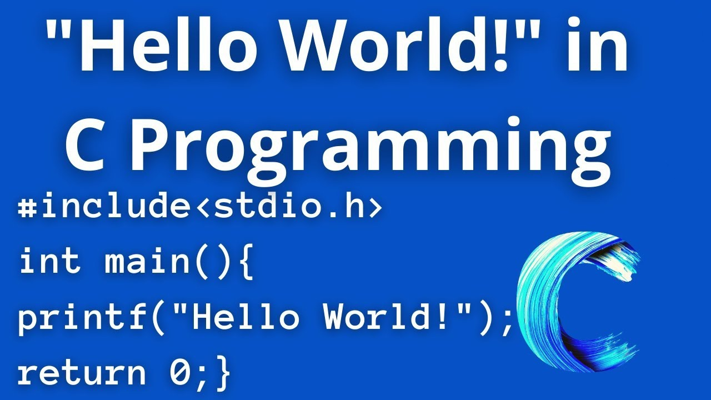
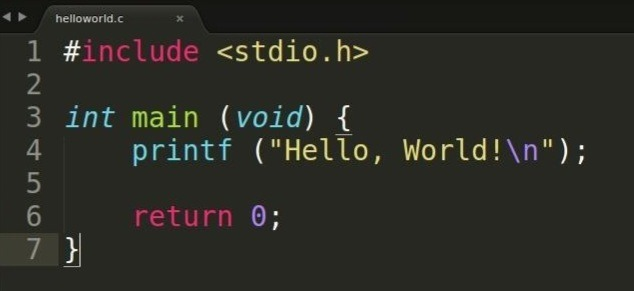

# Разъеб "Hello world"
> [Пацанская прога](https://t.me/+osWqEEfNA5Y2ZWYy), 27 марта 2023 

Воочию видел некоторое количество персонажей, в которых пример простейшего жлобского хелло ворлда
вселял поистине хтонический ужас. Собственно это и сподвигло меня разъебать этот исторический
отрывок кода и в деталях расписать, что и, главное, нахуя там написано. Приблизительно 0.83 секунд
гугления приводят нас напрямую к главному герою этого поста, спешите видеть!



Сразу привлекает внимание стиль, явно выбранный на фоне острого приступа шизофрении. Посмотрим на
другой пример. 



Обладая примитивными аналитическими способностями, возможно заметить ряд сходств между первым и
вторым примером.

Вкратце для дебилов - оба куска кода, приведенные выше делают одно и тоже - после запуска жидко
пукают фразой "Hello, World!" и завершаются. Несмотря на крайнюю дебильность действия, выполняемого
программами, выглядят они для неискушенного юзера весьма нелицеприятно.

## А че там под капотом?

Для среднего быдла с арсеналом в виде Code::Blocks и зачатками разума процесс выглядит следующим
образом - написали какой-то текст, возможно, даже понимая сакральный смысл высранного, ткнули в
кнопку с зеленой стрелочкой и оно написало "Hello, World!". Абсолютно ничего сложного. Однако если
у вышеупомянутого быдла отобрать Code::Blocks и удобную зеленую кнопочку, то оно жидко пукнет и
аварийно завершит свою короткую карьеру в этом вашем IT.

На самом деле при нажатии на кнопку происходит комедия в трех актах - компиляция, линковка и
исполнение. __Да кто такая это ваша компиляция?__ Ответить на этот основополагающий вопрос можно
кратко и по еблански или подробно и по человечески. Выберем первый стул. В процессе компиляции
человеко-читаемая ебанина с помощью т.н. компилятора и какой-то там матери превращается в
машино-читаемую ебанину. Подробно про этот процесс будет расписано в одном из следующих постов.
__Далее происходит линковка__, говоря упрощенно, связывание разных кусков воедино. Ну и наконец
сгенерированная программа __запускается__ и выводит пресловутый текст на экран. Однако опустим все
эти рассуждения о высоком и перейдем к построчному разбору 2-го Hello World'а.

## Подключение библиотек

В первой же строке нас встречает синтаксическая конструкция, позволяющая самым неочевидным образом
подсосать нужные нам вещи откуда-то из недр операционной системы. Однако в случае C и иже с ним,
данный ритуал может пригодится не только в случае применения каких-то сферических алгоритмов в
вакууме. Как видно, даже чтобы пукнуть на экран текстом, надо что-то подключать. На самом деле C
без подключенных библиотек мало на что способен, так как весь функционал в нем тщательно расфасован
по маленьким библиотекам, без использования которых даже посрать не выйдет.

На самом деле вся магия подключения библиотек заканчивается ровно в тот момент, когда узнаешь о
такой вещи, как __препроцессор__. Грубо говоря, это инструмент, позволяющий предварительно перед
компиляцией каким-то образом изменить код. В подробности, опять же, вдаваться не будем и рассмотрим
только подключение библиотеки. Вообще говоря, рецепт подключения либы в среднем такой получается:

```c
#include <stdio.h> 
// или 
#include "lib.cpp"
```

В первом случае мы тянем библиотеку откуда-то из запасников операционки, а во втором пытаемся найти
в той же папке, в которой сами же и работаем. 

Уже после того, как файл с либой был найден, препроцессор без какой-либо задней мысли бездумно
__копипастит__ все его содержимое в наш рабочий файл. Таким образом, если посмотреть на наш код после
этапа препроцессинга, он обрастает кучей чужого кода, втупую спизженного из системных файлов.

Собственно, в примере с `hello world` используется библиотека `stdio.h`, содержащая в себе набор
функций для работы с вводом и выводом (чтобы программе можно было сказать че-то и она даже могла
спиздануть че-то в ответ). Всратое название таит в себе глубинный смысл - `stdio` есть `Standart Input/Output`.
Собственно функция `printf`, упомянутая парой строк ниже, родом именно отсюда.

## Объявление функции

Концепция функций вообще широко распространена. Но почему-то далеко не все даже после институтской
проги понимают, что это за хуета и пишут свой код нечитаемым полотном, которым хочется подтереть жопу.
Попробую пояснить что такое функции. В целом, большинство задач в программировании повторяют друг друга
и часто приходится делать одни и те же действия. Простейший пример - взятие квадратного корня из числа.
Однако сам алгоритм происходящего не так тривиален, чтобы каждый раз воспроизводить его вручную.

Именно для этого и существует функция `sqrt`. Даже в отстранении от программирования понятно, что
`sqrt(9)=3`, а `sqrt(16)=4`. По сути, за названием функции спрятана настоящая реализация алгоритма,
о которой среднему быдлу знать не полагается.

Очевидно, функции можно не только использовать, но и создавать. Именно это мы видим в третьей строке
примера. В целом синтаксис объявления функции следующий:

_тип_возвращаемого_значения_ __название_функции__(параметры) 

Вообще говоря, функции в основном что-то возвращают. По сути это черный ящик, комбайн, которому мы
скармливаем входные данные, а он выдает нам какой-то вторичный продукт, произведённый из параметров. В
объявлении функции мы сразу заявляем, какие именно данные будет именно эта функция выдавать в ответ. В
нашем случае это целые числа, так называемый `int` (от слова integer). Название функции может быть выбрано
практически любое (ограничения рассмотрим, когда будем говорить про лексер компилятора), но в данном
случае назовем функцию именно `main`. В любой программе на C именно функция с таким названием будет
вызываться при запуске программы. В скобках вместо параметров написано слово `void`, обозначающее
отсутствие параметров, и, вообще говоря, совершенно не обязательное. Можно также оставить скобки пустыми.

Хорошо, объявить - объявили, теперь нужно объяснить компу, что именно будет делать свеженаписанная
функция. Для этого в фигурных скобках сразу после объявления пишется "тело" функции - действия, которые
будут выполняться при ее вызове. Собственно рассмотрим это самое тело.

## printf

Эта функция будет присутствовать по первости практически в любой консольной программе. Она позволяет
вывести на экран текст, переданный в скобках (в параметрах). Хотя устройство функции несколько сложнее,
чем я сказал, останавливаться на нем пока не будем и оставим чудеса форматирования текста на потом.

Собственно, строка, которую мы будем печатать, обрамляется кавычками, в конец осмысленного текста
добавляется некий `\n`. Этот `\n` обозначает символ перевода каретки (символ новой строки) - то, что мы
печатаем на самом деле, когда нажимаем Enter. Это сделано для того, чтобы текст, который будет выводится
впоследствии, не слипался в одну строку с предыдущим.

Ну и наконец точка с запятой, завершающая буквально любую _исполняемую инструкцию_ в языке C. Именно
исполняемую! После инклюда или объявления функции никаких точек с запятой мы не ставим, так как по факту
они не исполнямые. 

## return

И последний сегодняшний гость - инструкция `return`. Если вернуться на два раздела выше, то можно еще
раз прочитать про т.н. возвращаемое значение. Так вот `return` как раз таки это значение и возвращает. В
нашем случае из функции будет возвращен ноль. Всегда. Хоть усрись. Кстати, ноль является как раз таки
представителем типа `int`.

В конце ставится точка с запятой, как обычно.

## В качестве заключения 

Даже в таком простом примере, как Hello World, необходимо понимание многих основополагающих вещей,
которые в рамках одной статьи рассмотреть не удастся. Однако постепенно все эти понятия будут подробно
рассмотрены и пояснены, а данная статья будет казаться пособием для долбаебов с долбаебскими объяснениями.

Ну и в довесок конечно добавлю, что посты в канале буду стараться писать последовательно, чтобы даже
оконченный дебил смог осознать, о чем идет речь. Так что люди, которые хоть сколько то шарят - сорри,
но контент для вас будет позже. Наверное.
