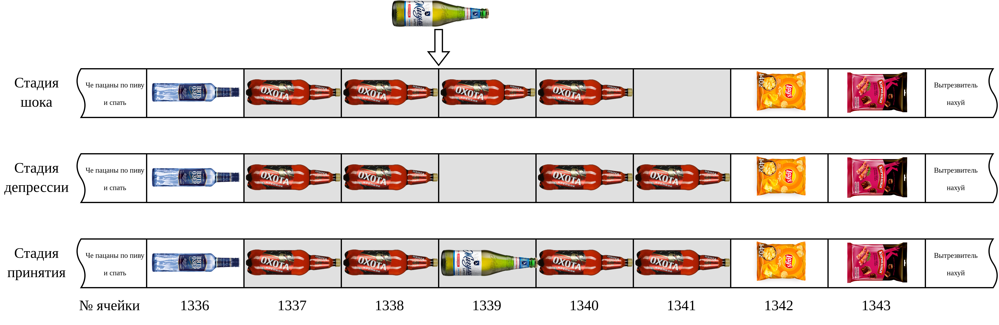

# Массивы и строки
> [Пацанская прога](https://t.me/+osWqEEfNA5Y2ZWYy), 26 июня 2023 

_Начну с дисклеймера. Данная статья имеет цель исключительно 
общеобразовательную. Некоторые понятия будут утрированы и в следующей статье
часть этих абстракций будут нещадно разрушены к хуям адресной арифметикой. Я 
предупредил._

Представим ситуацию - в вашем холодильнике стоит бутылка пива. Внезапно вы 
решили выйти в близлежащую рощу и усосать эту бутылку под шашлычок. Очевидное 
решение - взять эту бутылку в руку и пойти в рощу. Однако если бутылка будет не 
одна, а двадцать? Или вообще пятьдесят? Конечно можно навалить гору бутылок в 
руки и с некоторой вероятностью донести их. Но велика вероятность, что _ситуация 
выйдет из под контроля_ и пиво будут пить с земли окрестные бомжи. Какие решения 
могут быть у этой проблемы? Самое простое решение - взять ящик для пива. Тогда 
все 20 или 50 бутылок успешно встанут в аккуратный ящик и с вероятностью, 
близкой к единице, успешно доберутся до места дальнейшего употребления. 

По факту данная аллегория распространяется и на программирование. Только вместо 
пива у нас будут, например, целые числа, а вместо ящика - контейнерный тип. 
Например, `list` в Python. А как обстоят дела с контейнерными типами в C? 

Думаю по такой подводке уже стало понятно, что в C таких типов нет и в помине. 
Ну а хуле вы думали, это слишком просто. Вместо этого в C есть "массивы", 
сущность весьма туманная и опасная при неумелом использовании. Так в чем же 
отличия массива от какого-либо контейнера? В первую очередь нужно отметить, что 
контейнерные типы - по большому счету - абстракция, упрощающая жизнь и 
позволяющая практически не напрягать межушный ганглий в процессе их 
использования. Массив в свою очередь - вещь, минимально необходимая для доступа 
к нескольким схожим по виду сущностям.

## Итак, массив

Для начала прокачаем приведенную выше аналогию с контейнерными типами и ящиком 
для пива. В случае массивов представим что у нас есть огромный прицеп для 
автомобиля, который вмещает в теории _овердохуя_ бутылок пива. Дабы упростить 
поиск чего-либо в этом прицепе, разделим все его пространство на квадраты, 
каждый из которых имеет номер. Тогда знание, что нужная нам бутылка пива 
находится в квадрате №1337 поможет нам быстро раздуплиться и найти ее. В случае 
если у нас имеется большое количество идентичных бутылок, вместо того чтобы 
запоминать расположение каждой из них, можно выстроить их в ряд и запомнить, с 
какого номера начинается пиво. Тогда получится, что захотев взять очередную 
бутылку пива, мы сможем просто вспомнить, что пиво в прицепе начинается с 
квадрата №1337 и просто взять столько сколько будет необходимо, или же отсчитать 
нужную по счету бутылку от начала всех пив. 

Переложим теперь эту пивную постиронию на оперативную память. Как мы помним (да 
нихуя уже не помним) из одной из предыдущих статей, оперативная память по сути 
представляет собой длинную ленту из пронумерованных ячеек, каждая из которых 
вмещает один байт информации. Для наглядности приведу иллюстрацию массива в 
переложении на оперативную память.


На иллюстрации приведен пример фрагмент оперативной памяти, под ячейками 
подписаны их адреса. Конечно, мы можем для доступа к любому из пив запомнить их 
адреса и обращаться более конкретно. Однако это неудобно в случае, если пив 
будет не пять, а пятьсот. Для упрощения жизни запомним, что пив всего пять, а 
расположены они в ячейках начиная с номера `1337`. Тогда мы можем объявить 
массив `beers`, обращаясь к которому мы сможем указывать номер конкретной 
бутылки. Например, мы можем написать `beers[3]` для доступа к четвертой бутылке 
(sic!). Для непосвященных - нумерация в массивах в нормальных языках 
программирования начинается с нуля. Для нас это упрощает обращения с большим 
количеством однотипных объектов. 

Рассмотрим массив с точки зрения компилятора. Допустим, у нас есть объявление 
следующего типа:

```c
Vodka vodyara = ...;
Beer pivko[5] = {...};
Chips lays_s_syrom = ...;
Crackers kirieshki = ...;
```

Таким образом компилятор запомнит, что выделил одну ячейку с номером `1336` под 
водку, одну с номером `1342` под чипсы, одну с номером `1343` под сухарики и 
пять ячеек начиная с номера `1337` под пивас. В дальнейшем обращение к 
переменной `vodyara` будет заменяться на обращение к ячейке `1336`, так же и с 
переменными `lays_s_syrom` и `kirieshki`. 

С массивом пив будут происходить более хитрые действия. Например, мы хотим 
получить доступ к первой бутылке пиваса, для чего используем обращение к 
массиву `pivko[0]`. Данное обращение по факту будет заменено на обращение к 
ячейке с номером `1337 + 0 = 1337`. Таким же образом, обращение к `pivko[3]` 
будет заменено на обращение к ячейке `1337 + 3 = 1340`. Легко заметить, что это 
адрес ячейки, в которой лежит четвертое пиво.

Таким образом, массив в C-подобных языках - это по сути адрес первой ячейки 
массива, в котором все элементы идут подряд. В целом звучит в максимальной 
степени очевидно, однако из такого подхода вытекают некоторые проблемы, которые 
могут привести к глубокому недопониманию в лучшем случае и к срочной 
госпитализации с кодом F60.1 в худшем. Рассмотрим эти проблемы и способы, 
которыми некоторые сообразительные персонажи их решают.

## Out of bounds

Это снобское выражение по сути представляет проблему выхода за пределы массива. 
Допустим, мы объявили некоторые переменные и массив, как в предудущем разделе. 
Однако по ошибке или в результате тугоумия попытались обратиться к пятому 
элементу массива `drink(pivko[5])`. Такая конструкция превратиться в нечто вроде 
"выпить пиво по адресу `1337 + 5`". Выходит, что мы пытаемся выпить нечто, 
лежащее в ячейке с номером `1342`, то есть пачку чипсов. Исходя из жизненных 
примеров, ситуация эта достаточно забавная, но в целом некорректная. Получается, 
такое обращение к массиву может привести к тому, что программа будет работать 
совершенно не так, как предполагается.

Другой вариант - мы пытаемся положить что-либо новое в массив `pivko[5] = ....` 
В таком случае получится, что мы положим новое пиво в ячейку, в которой уже 
лежат чипсы. Это приведет к аннигиляции вышеупомянутых. Кроме того, в дальнейшем 
новое пиво может быть также неявно перетерто чем-то, положенным в переменную 
`lays_s_syrom`. 

При всем вышеупомянутом помимо информации об адресе первой ячейки для массива 
ничего другого компилятор в общем случае не запоминает. Таким образом, следить 
за возможным выходом за границы массива нужно следить вручную, например, заведя 
переменную с длиной массива или терменируя весь массив дополнительным последним 
элементом. Однако последний способ все равно не защитит от ошибочного обращения 
сходу за пределы массива.

## Проблема вставки нового элемента в центр

Рассмотрим ситуацию, когда мы выделили массив с запасом, например под пять пив, 
а положили в него всего четыре. Однако после этого может возникнуть 
необходимость вставить новое пиво между вторым и третьим по счету. Так как все 
данные в массивах лежат последовательно друг за другом, возникает проблема, что 
нам тупо некуда совать новое пиво. В таком случае приходится освобождать место 
под новое пиво, сдвигая все остальные на одну ячейку вперед. Данный процесс 
изображен на иллюстрации.



Вроде ничего сложного и не происходит, однако сдвиг всех элементов массива 
занимает достаточно длительное время, подробнее о чем я расскажу в статье про 
алгоритмическую сложность.

## Вместо заключения

Конечно, компилятор всячески старается помогать в решении всех вышеупомянутых 
проблем (в частности ловит out of bounds), но происходит такое достаточно редко, 
в случае, если размер массива известен на этапе компиляции. Однако по факту чаще 
используют динамическую память, в таком случае компилятор бессилен в поиске 
ошибок такого рода. В целом выходит, что массивы - это быстро, компактно, 
эффективно, стильно, молодежно, но при всем при этом весьма травмоопасно, так 
как риск объебаться велик.
