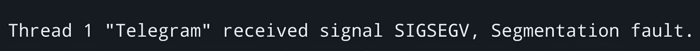

# Адресная арифметика
> [Пацанская прога](https://t.me/+osWqEEfNA5Y2ZWYy), 2 февраля 2024

_**Увага**: данная тема настолько критически важна для понимания принципов 
работы низкоуровневых языков, в частности, великого и могучего, насколько и 
травмоопасна для неподготовленных девственно чистых умов. Я предупредил._

## Интро

В статье про типы данных я уже набрасывал на вентилятор такое понятие, как 
оперативная память. Предлагаю освежить воспоминания. Итак, думаю большинству 
известно, что оперативная память есть в любом компе как физическая составная 
часть, но многие даже близко не предполагают, зачем она там вообще нужна и чем 
конкретно занимается. _Штош_, разберемся.

В первую очередь важно понять, в чем отличие оперативки от жесткого диска (без 
шуток, есть те кто на серьезных щщах этого не понимает) и почему 64 гига - много 
для оперативки и мало для жесткого. Самое ключевое различие - время случайного 
доступа (на человеческом - задержка между запросом у устройства некоторых данных 
и получением от него ответа). Например, для SSD-диска время доступа составляет 
порядка нескольких десятков микросекунд, в то время как у современной оперативки 
это время составляет уже несколько десятков наносекунд (Про время доступа к 
HDD-дискам я лучше промолчу, оно на несколько порядков выше чем у SSD). Сразу 
заметна  разница в три порядка между временами доступа к диску и оперативке. 
Почему тогда нам всем дружно не хранить свои "Новые папки 372919ж432ло" в 
оперативке, чтобы быстрее доступаться к мемчикам в них? Ответ прост - оперативка 
энергозависима. Это значит, что после выключения компа всё что лежало в 
оперативке будет аннигилировано с особой жестокостью.

Именно по этой причине программы хранят все свои промежуточные данные в 
оперативке. Как уже упоминалось в статье про массивы, оперативка в общем случае 
представима, как длинная лента, в которой каждая ячейка имеет номер. Этой 
абстракцией воспользуемся и сейчас, дабы не углубляться в подробности 
современного устройства и работы оперативки.

## Ваши любимые аналогии

По старой доброй традиции придумаем красивую аналогию для оперативки. В целом 
всю концепцию адресов можно представить как улицу, на которой расположены 
участки земли. Допустим, каждый участок имеет свой индивидуальный номер. На 
каждом из участков может располагаться любое говно на усмотрение хозяина 
участка. Помимо прочего, некоторые _новые русские_ могут позволить себе владеть 
сразу несколькими участками, причем вполне реально, что эти участки будут 
расположены рядом друг с другом. Таким образом, те самые новые русские могут 
расположить на них что-либо столько громадное, насколько это возможно.


Окей, с аналогиями закончили, теперь имаджинируем ситуацию. Допустим, вы 
приезжий и не знаете ничего о пресловутой улице. Однако вы знаете, что на этой 
улице живет некий Игорёк, который вас _газлайтил и занимался прочим боулингом_. 
Теперь вы, как настоящий мужчина, собираетесь насрать ему под дверь и написать 
пару ласковых, используя _особые чернила_. Очевидно, вам необходимо каким-либо 
образом идентифицировать среди кучи домов дом Игорька. Еще более очевидно, что 
метод такой идентификации был придуман еще боевой полторашкой в 1805 году. Если 
вы обладаете знанием, что Игорек окопался на участке №1337, то вы успешно 
найдете его и сможете произвести нехитрые манипуляции. Однако задача значительно 
усложнится, если вместо __номера участка__ у вас будет фотография дома Игорька. 
В таком случае вам придется идти по всей улице и искать внешне именно такой дом, 
а это, вообще говоря, задача нетривиальная в общем случае. Кроме того, сыграть 
злую шутку может и застройщик, который наебашил с десяток одинаковых домов на 
этой улице, ведь тогда вы никогда не будете уверены, что насрали именно Игорьку 
под дверь (ну или придется срать десять раз, это уже на ваше усмотрение).

Таким образом, мы приходим к основному тезису: __адрес жизненно необходим для 
однозначной идентификации некоторого объекта.__

Из этого примера так же становится понятно, что для того, чтобы 
_отредактировать_ объект, необходимо каким-либо образом до него добраться 
физически. Для большего понимания, введем новый термин - __значение__. В рамках 
нашего повествования появляется следующий маппинг:

```
ячейка оперативной памяти = участок на улице
адрес ячейки = номер участка
значение = любые постройки/содержимое участка
```

Допустим, в начале улицы сидит консьерж, к которому можно подойти с вопросом 
"Пустите, мне нужно насрать под дверь дома на участке №1337". Рассмотрим 
ситуацию, в которой произошел конфуз и вместо того, чтобы пустить вас на улицу, 
консьерж предложил вариант попроще - он просто вручил вам дом Игорька, который 
вы, не отходя от кассы, успешно обосрали. Однако так как в рамках истории наша 
улица приближена к поведению оперативной памяти, то консьерж не просто взял дом 
с участка, а построил его точную копию, при этом оригинальный дом остался стоять 
на месте. Таким образом, с одной стороны, задача выполнена, но с другой 
стороны - цель достигнута не была и вы остались с обосранной копией дома 
Игорька, который, кстати, вообще о произошедшем не подозревает.

Очевидно, что для избежания такого рода конфуза есть несколько решений - либо 
консьерж впустит вас на улицу и укажет куда идти, после чего вы сами дойдете до 
оригинального дома и сделаете свое грязное дело, либо вы передадите свою жопу 
консьержу, чтобы он сходил с ней к дому субьекта и сделал грязное дело за вас. 
В любом случае необходимо производить обращение по адресу, так как вам 
необходимо отредактировать объект, уже расположенный где-то на улице. 

Так и в оперативной памяти, вместо того, чтобы оперировать только значением, 
можно сходить в определенное место оперативки и нагадить там.

## К сути

Рассмотрим кусок кода, который считывает целое число из консоли и выводит 
квадрат этого числа. 

```c
#include <stdio.h>

int main()
{
  int value = 0;
  scanf("%d", &value);
  printf("Square of %d is %d!\n", value, value * value);
  return 0;
}
```

Происходящее в этом куске кода частично похоже на то, что было описано в статье 
про Hello World, так что перейду сразу к интересному.

А интересует нас в первую очередь то, как мы создаем переменную и записываем в 
нее результат. Итак, приступим. В первой же строке с помощью конструкции 
`int value = 0` создается целочисленная переменная со значием `0`. По факту, под 
именем `value` прячется номер ячейки оперативной памяти, в которой будет лежать 
само число. Однако если мы попытаемся передать кому то инфу про эту переменную, 
то по сути просто передадим содержимое ячейки, что нас не устраивает, так как 
нам это содержимое необходимо заменить на введенное пользователем. 

Следующей строкой идет вызов функции `scanf()` из библиотеки `stdio.h`. Эта 
функция позволяет считать данные с клавиатуры и куда то поместить. В нашем 
случае необходимо считать число и положить его в переменную `value`. Однако 
сканфу ничего об этой переменной неизвестно и он не знает, куда деть считанное 
число. 

Это приводит нас к тому, что необходимо дать сканфу указание, куда именно 
вписывать результат - в нашем случае это переменная `value`. Если бы мы передали 
переменную сканфу в чистом виде, то он получил бы только значение этой 
переменной, что не помогло бы ему разобраться с тем, куда класть результат (а 
то, что лежало раньше в переменной, сканф мало волнует в целом). Подытоживая, 
как и в случае с улицей, мы выясняем адрес переменной с помощью операции 
`&value` и передаем полученный адрес функции сканф. Она же в свою очередь сама 
идет в необходимый адрес и записывает в него результат. Возвращаясь к аналогии 
с улицей - при необходимости отправить кого-либо на определенный участок мы 
передаем ему адрес этого участка, чтобы исполнитель смог найти его и каким-либо 
образом с ним провзаимодействовать.

## Использование адресов

В рассмотренном выше примере мы превращали переменную в адрес, чтобы подсунуть 
его функции из стандартной библиотеки сей, однако часто придется пользоваться 
адресами и в повседневной жизни. Например, если нам необходимо вернуть из 
функции два числа, а через `return` в общем случае мы можем опрокинуть только 
одно. Конечно, можно воспользоваться структурой, но о них мы будем говорить 
позже, к тому же, они не всегда подходят по смыслу к тому, что мы хотим сделать. 
В качестве примера рассмотрим функцию для поиска корней квадратного уравнения. 
Реализацию данной функции мы смотреть не будем, нам интересно только, каким 
образом из нее возвращать результат.

```c
int solve(struct Equation eq, float* x1, float* x2)
{
  ... // Здесь каким-либо образом решаем уравнение
  *x1 = .....;
  *x2 = .....;
  return roots_count;
}
```

Так как квадратное решение может иметь 0-2 корня, нам нужно придумать каким 
образом выдавать результат. Одним из вариантов может быть передача в функцию 
двух адресов (по этим адресам будем укладывать значения корней уравнения) и 
возврат из нее количества корней. Таким образом, вызывающая сторона сможет 
сразу создать переменные (или массив) под корни и попросить функцию `solve` 
записать в них полученные решения. Помимо этого функция `solve` вернет 
количество корней, чтобы вызывающая сторона знала, сколько корней заполнила 
функция.

Разберем по кускам, каким образом в коде реализуется данная задумка. В первую 
очередь необходимо понять, что за звездочки накиданы в каждой строке. Как и 
полагается трушному низкоуровневому языку, звездочки в сях меняют свое значение 
в зависимости от контекста (хотя с практикой приходит некоторое интуитивное 
понимание такого синтаксиса, но я все же распишу подробно).

Давайте вспомним про типы данных из предыдущих статей. Там было упомянуто, что 
переменные, в которые вы собираетесь впихнуть дробное число, в народе имеют 
погоняло `float`. Видно, что именно это слово написано перед названием 
переменной `x1` и `x2`. Теперь осталось понять, что значит звездочка рядом с 
типом данных. А значит она, что это самое `x1` есть ни что иное, как адрес в 
оперативной памяти, в который положено класть данные типа `float`. Также стоит 
напомнить, что адрес по сути своей является такой же переменной, то есть мы 
можем сделать нечто вроде `float* x_address = &x`. По сути мы вычисляем адрес 
переменной типа `float` и кладем его в переменную типа `float*`. Продолжать так 
можно до бесконечности, например `int****** xyi` - это не "пиздец че это такое", 
а указатель на переменную, содержащую указатель на переменную, содержащую 
указатель на переменную, содержащую указатель на переменную, содержащую 
указатель на переменную, содержащую указатель на переменную, содержащую число 
типа `int`. Ахуеть, заверните два с собой и добрый колу на запить. 

)")

Так, с `float*` вроде разобрались, посмотрим на строку `*x1 = ....;`. Это вообще 
не стыкуется с предыдущим объяснением. В данном случае звездочка обозначает 
операцию обращения по адресу, лежащему в переменной `x1`. Например, в 
оперативной памяти по адресу `873567` у нас лежит число `2.8`. Таким образом, 
если мы попытаемся распечатать `x1`, то получим число `873567`, а если будем 
печатать `*x1`, то увидим число `2.8`. По сути это так же прекрасно 
накладывается на аналогию про улицу, ведь звездочка перед переменной, содержащей 
адрес - это по сути прямой указ "пиздуй по этому адресу". 

Таким образом с помощью рассматриваемой строки мы идем по некоторому адресу, 
который нам приехал от вызывающей стороны и укладываем туда результат наших 
потуг. Стоит отметить, что и в этом случае можно иногда нахерачить миллиард 
звездочек, например, чтобы распечатать значение инта, на который ссылается 
указатель, на который ссылается указатель, на который ссылается указатель, на 
который ссылается указатель, на который ссылается указатель, на который 
ссылается указатель `int****** xyi`, придется написать нечто вроде 
`printf("%d\n", ******xyi);`.

## Связь указателей с массивами и строками

Как вы помните, в статье про пиво и массивы я упоминал, что мы можем обращаться 
к массиву или строке (которая по сути является массивом букав) через адрес 
первого элемента в этом массиве/строке. То есть, если не лукавить - любой 
массив или строка в сях это по сути просто указатель, указывающий на адрес 
начала массива/строки. Теперь, вооружившись знанием о значении звездочки, мы 
можем извратиться и показать, что есть массив на самом деле. Приведем пример 
массива целых чисел.

```c
massive[5]                    // Привычное обращение к массиву
*(massive + 5 * sizeof(int))  // То же обращение, но на черном наречии
```

В целом, конструкция до ужасного очевидная, хоть и выглядит стремно. 
Вооружившись знанием, что `massive` - адрес первого элемента массива, каждый 
элемент занимает несколько ячеек `(sizeof(int)` как раз таки позволяет узнать, 
сколько конкретно), мы можем вычислить, что пятый элемент массива будет 
находиться именно по адресу `massive + 5 * sizeof(int)`, чтобы впоследствии к 
этому адресу обратиться с помощью звездочки. Кстати именно осознание этой 
конструкции приводит к пониманию, почему нумерация элементов в массиве в 
нормальных языках начинается с нуля, а не с единицы 
(`massive + 0 * sizeof(int) = massive`, то есть по сути адрес нулевого элемента 
по этой формуле и является адресом начала массива)

## А какие подводные

Несмотря на то, что указатели - вещь абсолютно ультимативная, они могут привести 
к _роскомнадзор_ и _роскомнадзор_. Самый распространенный факап - попытка 
постучаться по нулевому адресу. Так повелось, что для того, чтобы пометить 
указатель, который создан, но ни на что не ссылается, придумали слово `NULL`, 
по сути своей являющееся числом ноль. То есть если вы объявите указатель 
`int* pointer = NULL;` и попытаетесь сделать нечто вроде `*pointer`, то 
закономерно получите `SIGSEGV` на пару с расстройством пищеварительной системы. 
Современные операционки всеми силами стараются защитить оперативную память от 
посторонних вмешательств и на корню пресекают любые попытки уйти из уютной 
выделенной оперативки. Иными словами - шаг влево, шаг вправо - `SIGSEGV`. 



Кроме того возникает проблема, что мы можем успешно проебать некоторые данные, 
которые положили по указателю. Например, перезаписав этот указатель. После этого 
_поступка настоящего героя_ мы уже не сможем восстановить адрес, в котором 
остались одиноко и безхозно лежать данные. Мало того, при некоторых 
обстоятельствах эти данные еще и не будут удалены потом, то есть мы просто 
засрем часть памяти говном, забудем про него и оно там будет лежать и вонять, 
пока мы не перезагрузим комп.

## Подытожим

Все это далеко не все применения и выстрелы в ногу, исходящие из адресной 
арифметики. Однако углубляться еще будет весьма травмоопасно, поэтому 
остановлюсь именно на этой позитивной ноте. Возможно, потом я напишу еще одну 
статейку, в которой покрою остальные нюансы.

Еще хочу напомнить, что я открыт к фидбэку - если нашли какой то буллщит или не 
поняли отдельные буквы/слова/абзацы, или же хотите уточнить что-то, то прошу в 
коменты.
